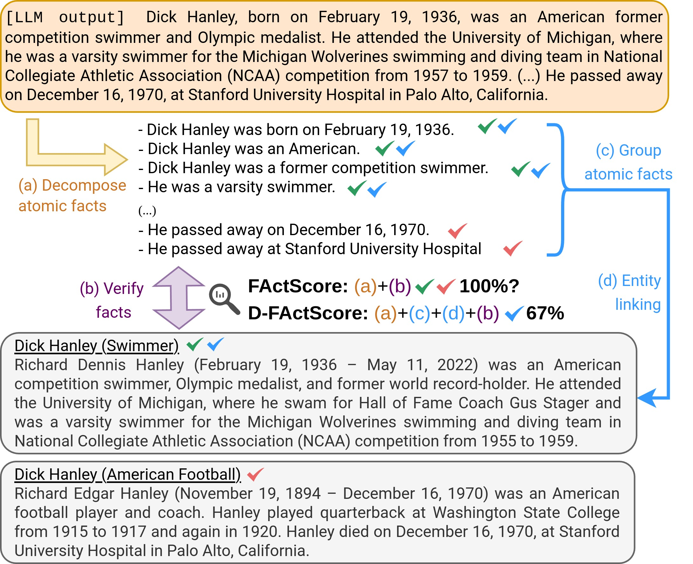

# Merging Facts, Crafting Fallacies: Evaluating the Contradictory Nature of Aggregated Factual Claims in Long-Form Generations
This repo contains the codes and data used in our paper [Merging Facts, Crafting Fallacies: Evaluating the Contradictory Nature of Aggregated Factual Claims in Long-Form Generations](https://arxiv.org/abs/2402.05629).
In this paper, we show that:
1. LLMs can generate non-factual paragraphs full of factual claims due to entity ambiguity.
2. We construct a list of 500 ambiguous names from Wikipedia, **AmbigBio**. We use these names to generate biographies using retrieval augmented generation with citations.
3. We show that FActScore and citation recall cannot properly evaluate these non-factual paragraphs.
4. We modify FActScore into D-FActScore to evaluate the factuality of paragraphs with entity ambiguity.

This repo contains the AmbigBio, the codes and instructions to generate the biographies, and the code for evaluating these generations using D-FActScore.
We also share the generation results and evaluation results here.



## Quick Links
- [AmbigBio](#ambigbio) 
- [Generating Biographies](#generating-biographies)
- [D-FActScore](#d-factscore)
- [Results](#results)
- 

## AmbigBio
The data of AmbigBio are placed in `AmbigBio/`.
There is one file in this directory
- `AmbigBio/AmbigBio.csv`: A csv file with 500 names. The first column is "Tell me a bio of \<name\>" and the second column is the name.

We also release the top-100 retrieval results retrieved from Wikipedia 20181220 dump using GTR in [this google drive link](https://drive.google.com/file/d/1ZlqqMcjSvzk20XE1ngyax-fZS9DPljvG/view?usp=sharing)

## Generating Biographies
We use [ALCE](https://github.com/princeton-nlp/ALCE/tree/main) style to generate the biographies with citations using retrieval-augmented generation.
Please follow the instructions in [ALCE](https://github.com/princeton-nlp/ALCE/tree/main) to clone the repo and install necessary packages.

Next, move the files in `./ALCE` to the [ALCE](https://github.com/princeton-nlp/ALCE/tree/main) repo you just cloned.
We modified the `run.py` and `eval.py` in the original ALCE repo to fit in our use case.
We only modify the data pre-processing part how the inputs and prompts are handled.
The configs for generating the people biography are placed in `./ALCE/AmbigBio_configs/`; these configs will be used for generating the biographies.
You can generate the people biography by running 

```python3 run.py --config PATH_TO_AMBIGBIO_CONFIG```

in the ALCE directory you just cloned, where `PATH_TO_AMBIGBIO_CONFIG` is a `.yaml` in `./ALCE/AmbigBio_configs/`.

## D-FActScore
Our implementation of D-FActScore is largely based on [FActScore](https://github.com/shmsw25/FActScore).
To run D-FActScore on the biographies generated in the previous step, you will need to clone the [FActScore](https://github.com/shmsw25/FActScore) and install the necessary dependency.
Also, remember to prepare your OpenAI API key following the instructions in [FActScore](https://github.com/shmsw25/FActScore).
We recommend you to use a seperate conda environment for the codes of FActScore.

Next, please move the files in `./FActScore/factscore` to the `factscore` subdirectory you just cloned.
The `*.py` files in we added are for D-FActScore: `coreference.py` is for splitting the biographies; `factscorer_ambig.py` is for calculating the D-FActScore and FActScore.
 
D-FActScore requires the knowledge source to for retrieval.
We prepare the knowledge source for you.
You can download the file from [this google drive link](https://drive.google.com/file/d/1X6yD4-Jol2iZPIRKAf9AxXLJ7jW_4Col/view?usp=sharing).
Download the file, uncompress it, and rename it into `FActScore/.cache/factscore/`, where `FActScore` is the FActScore root directory you just cloned.
In this compressed file, we also provide the cache of the results when we query the OpenAI models, so we should be able to reproduce our experiment results using those cache files.

To evaluate D-FActScore of the paragraphs generated in by ALCE, you can run

```
python3  factscore/factscorer_ambig.py \
  --input_path ALCE_OUTPUT_JSON \
  --model_name retrieval+ChatGPT \
  --openai_key OPENAI_API_KEY \
  --n_samples 500 \
  --verbose \
  --knowledge_source enwiki-20181220 \
  --abstain_detection generic
```
where the `ALCE_OUTPUT_JSON` should be replaced with the ALCE output json file generated in the previous step.

## Results
We share the results of the experiments in our paper.
1. Paragraphs generated by LLMs: `result/alce_output/`
2. D-FActScore automatic evaluation: `result/factscore/`
3. Citation recall: `result/alce_score/`
4. D-FActScore human evaluation: `result/human_eval_result.csv`

## Citation
If you use AmbigBio or find D-FActScore useful, please cite
```
@misc{chiang2024merging,
      title={Merging Facts, Crafting Fallacies: Evaluating the Contradictory Nature of Aggregated Factual Claims in Long-Form Generations}, 
      author={Cheng-Han Chiang and Hung-yi Lee},
      year={2024},
      eprint={2402.05629},
      archivePrefix={arXiv},
      primaryClass={cs.CL}
}
```

If you use D-FActScore, please also cite FActScore.
```
@inproceedings{ factscore,
    title={ {FActScore}: Fine-grained Atomic Evaluation of Factual Precision in Long Form Text Generation },
    author={ Min, Sewon and Krishna, Kalpesh and Lyu, Xinxi and Lewis, Mike and Yih, Wen-tau and Koh, Pang Wei and Iyyer, Mohit and Zettlemoyer, Luke and Hajishirzi, Hannaneh },
    year={ 2023 },
    booktitle = { EMNLP },
    url={ https://arxiv.org/abs/2305.14251 }
}
```